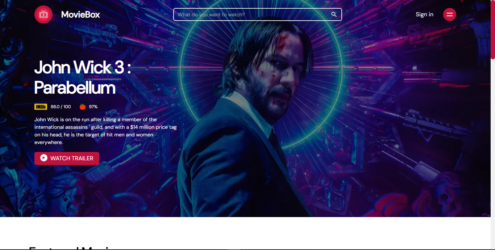
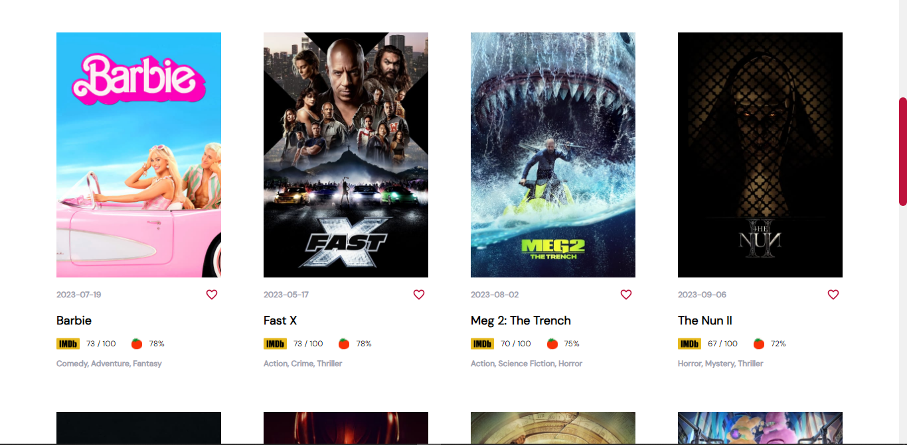
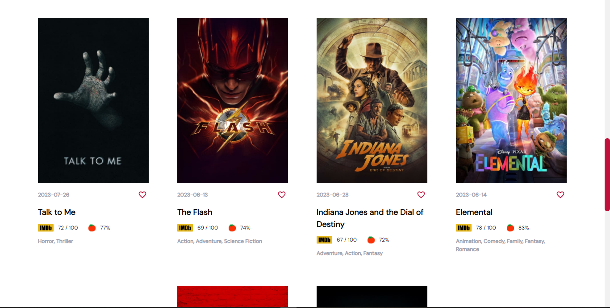
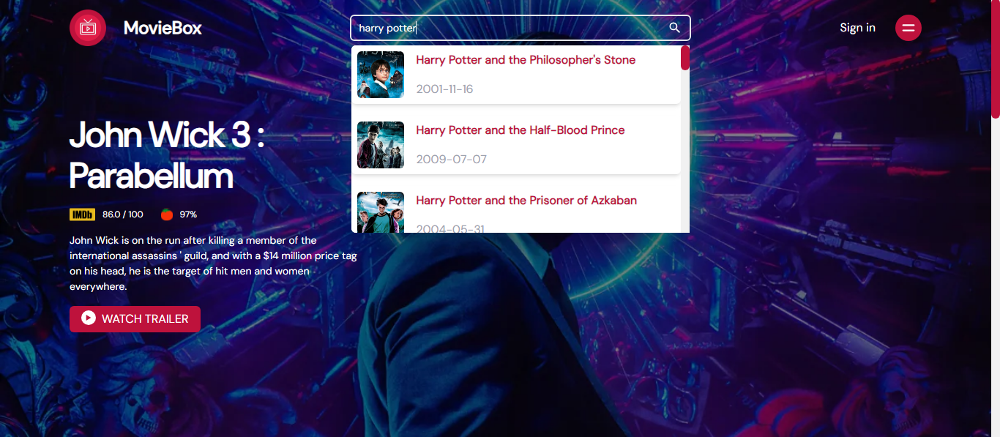
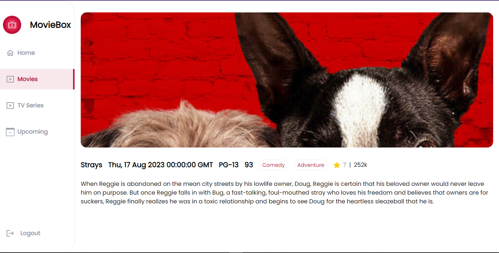

# MovieBox

This is a react application that allow users to view the top 10 popular movies, search for any movie and also to view each particular movie for more details about the movie

# Getting started

To run this application, you will to install node js and npm if you dont have them installed already

- clone this repository: ```git clone https://github.com/Sosaristic/hng-task2.git```
- navigate to the project directory: ``` cd hng-task-2```
- run this command: ```npm install```
- create a .env file in the root of the application and add your TMBD key as VITE_API_KEY = <your_api_key>
- start the development server: ```npm run dev```
  if everything goes well, the application will be running on http://localhost:3157.

# How to use

- On the hompage a list of top 10 popular movies should be displayed
- click on individual movie card to navigate to a movie page to see more details about the movie
  searching for a movie
- In the search box type in the querystring of the movie and wait for a result
- You can click on the search result card to navigate to the movie page to view more details

# screenshots







# Credits

This project was created by ander_dev. it uses the Movie database (TMDB) api to retrieve movies data
